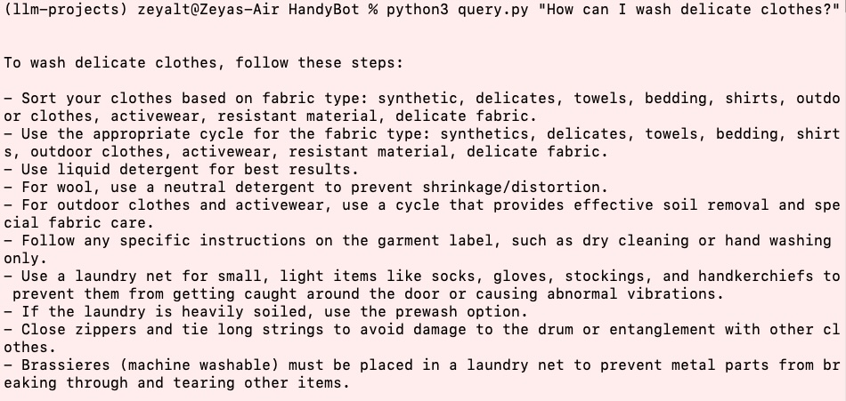

# HandyBot 🤖

**My Virtual Handyman for Home Appliances**

## 🌟 What is HandyBot?

HandyBot is my personal assistant for answering questions and providing advice about the electrical appliances in my home. Whether it's troubleshooting your washer, setting up your coffee machine, or understanding your fridge's error codes, HandyBot is here to help —- without needing a human handyman!

Here are some examples of questions we can ask HandyBot: 

## 🏆 Key Features and Advantages

- Quick and Reliable Answers: Get instant, accurate advice tailored to your appliance.
- Supports Multiple Devices: Handles a wide range of appliances such as washers, dryers, fridges, and coffee machines.
- User Manual Integration: Reads and processes information directly from your appliance's user manual in PDF format.
- 24/7 Availability: Accessible anytime, anywhere, for immediate help.
- Cost-Effective: A smart alternative to costly handyman visits for minor issues or questions.

## 🛠️ How Does HandyBot Work?

HandyBot uses a combination of generative AI techniques to provide its capabilities:
- PDF Parsing: Automatically reads and indexes user manuals to create a rich database of appliance knowledge.
- OpenAI's Model: Powers the conversational intelligence for natural and intuitive interaction.
- Retrieval Augmented Generation (RAG): Combines language model capabilities with document retrieval to extract relevant details from product user manuals.

By integrating these techniques, HandyBot ensures that its responses are both contextually accurate and informed by authoritative sources.